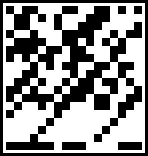
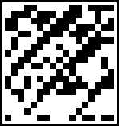

# clone-barcode
Creates barcode with specific rules.

#### Information format
Barcode information is stored as an Object as follows:
```javascript
const param = {
  /**
   * clone gender, string - "male" or "female" only
   */
  sex: "",
  /**
   * clone identifier, string - strictly 10 characters
   * small & large Latin letters and numbers
   */
  id: "",
  /**
   * clone name, string - small & large Latin letters,
   * numbers and spaces (0-26 characters)
   */
  name: ""
}
```

#### Rules
The barcode has a fixed size - 148x156 pixels.
There are black and white frames 3 pixels each along the perimeter of the barcode.
Inside these frames is the barcode content consisting of 18 lines each of 17 black or white squares per line.
The size of each square is 8x8 pixels.

White squares is 0, black squares are 1.

#### Barcode content generation algorithm
At the first row and the first column intersection there is a square drawn the gender (sex).
The value of "female" is white, "male" is black.
Further, there is a line formed from the fields id and name like this: **&lt;id&gt;&lt;name&gt;**.
The name field is padded with spaces at the end (up to 26 characters).
The resulting string is converted into a byte array - each character of the string is assigned the corresponding ASCII code (a number from 0 to 255).
Then each element of the resulting array is translated into binary notation (eight symbols of 0 or 1) and encoded by a sequence of eight squares (0 - white square, 1 - black square).
Squares are drawn in the barcode content sequentially and line by line.

#### Control information
The last line contains control information.
Each square in the line of control information determines the parity of the sum of the content values ​​in the corresponding column.
If the sum of 0 and 1 in the column is even then a white square is drawn in the control information.
Otherwise, a black square is drawn.

#### Examples

##### Code
```javascript
const obj = {
  sex: "male",
  id: "c5j818dyo5",
  name: "Oleg Vladimirovich"
}
```
##### Barcode


***

##### Code
```javascript
const obj = {
  sex: "female",
  id: "0owrgqqwfw",
  name: "Dazdraperma Petrovna"
}
```
##### Barcode

